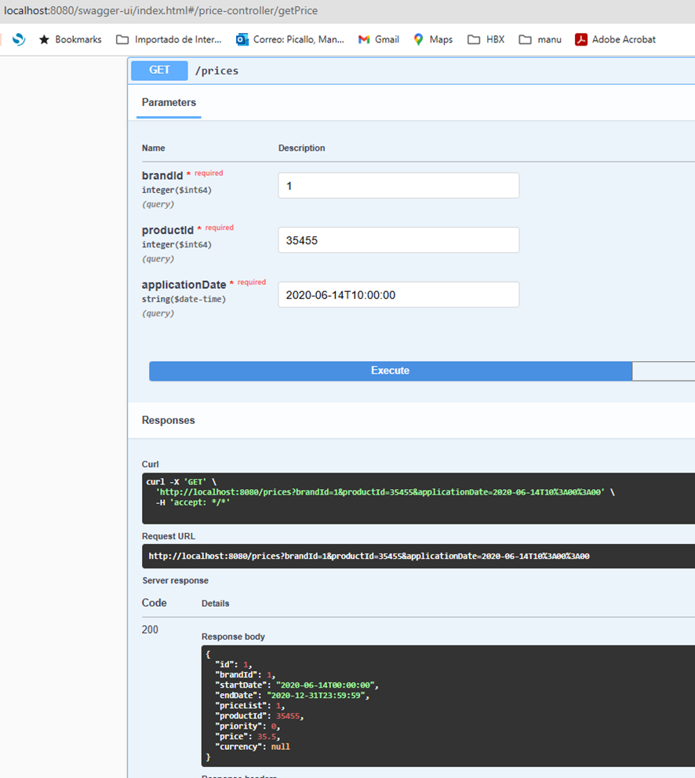
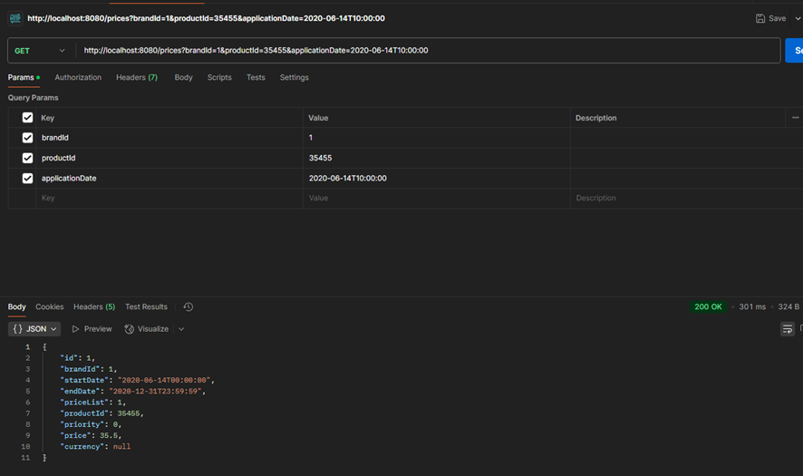

# restapi-product

### Resumen
Esta aplicación es una API REST que permite consultar el precio final de 
un producto en función de los siguientes parámetros:

* Fecha de consulta.
* Identificador de la marca (brandId).
* Identificador del producto (productId).
  
El sistema calcula automáticamente el precio a partir de las reglas de prioridad 
configuradas en la base de datos. Esto asegura que, ante solapamientos de precios, 
se devuelva el precio más relevante para la consulta.

### ¿Qué hace esta aplicación?
The following guides illustrate how to use some features concretely:

* Consulta de precios: Devuelve el precio final de un producto en un momento específico, teniendo en cuenta la marca, producto y las reglas de prioridad de los precios.
* Manejo de excepciones: La API devuelve mensajes personalizados en caso de errores, como precios no encontrados o solicitudes mal formadas.
* Interfaz Swagger: Documentación interactiva de la API generada automáticamente para facilitar las pruebas y el uso.

### Stack Tecnológico

* Java 17: Lenguaje de programación principal.
* Spring Boot 3.4.2: Framework para crear aplicaciones Java rápidas y robustas.
  * Spring Data JPA: Para la persistencia y acceso a datos.
  * Spring Web: Para crear la API REST.
  * Springdoc OpenAPI: Para generar automáticamente la documentación de la API en Swagger.
* H2 Database (v2.2.224): Base de datos embebida para un entorno ligero de desarrollo y pruebas.
* Lombok: Reducción del código boilerplate (getters, setters, constructores, etc.).
* Maven: Herramienta de construcción y gestión de dependencias.
* Postman: Para probar los endpoints manualmente.
* Swagger-UI: Interfaz gráfica para explorar y probar la API directamente desde el navegador.

### Estructura del proyecto

La aplicación sigue una arquitectura limpia basada en puertos y adaptadores (Hexagonal):

* adapters.in.rest: Controladores que gestionan las solicitudes HTTP y envían las respuestas al cliente.
* adapters.out.persistence: Acceso a la base de datos mediante JPA.
* application: Lógica de negocio central, independiente de la infraestructura.
* domain: Modelo de dominio y puertos que definen las interfaces para los casos de uso.
* resources: Archivos de configuración (application.yaml) y datos iniciales (import.sql).

### Instrucciones de compilación y ejecución

* Compilar el proyecto con Maven: mvn clean install
* Ejecutar la aplicación:   mvn spring-boot:run

### Probar la aplicación

* Swagger-UI

* Postman:

### Cómo funciona la lógica de precios

1. Se realiza una consulta con:

* brandId: Marca del producto.
* productId: Producto solicitado.
* applicationDate: Fecha en la que se desea conocer el precio.

2. El sistema:

* Busca los precios cuyo startDate y endDate cubran la fecha de consulta.
* Ordena por prioridad (priority) y devuelve el precio más relevante.

### Pruebas unitarias e integración

* Unitarios: Se probaron los servicios y repositorios con JUnit 5 y Mockito.
* Integración: Pruebas que validan la funcionalidad end-to-end con la base de datos H2.

### Autor
Manuel Angel Picallo Pérez 

mapicalloperez@hotmail.com

